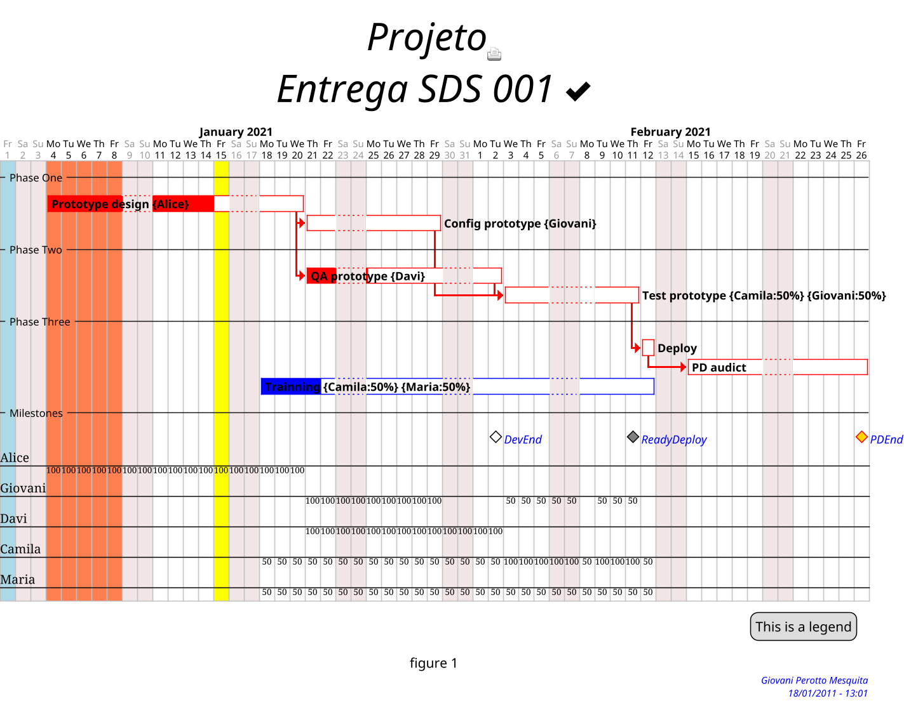

# required metadata

title: [Building Gant diagrams with PlantUML]
description: [How build Gant diagram with scripting PlantUML tool.]
author: [https://github.com/GiovaniPM]
manager: Giovani Perotto Mesquita
ms.date: 1/20/2021
ms.topic: article
ms.prod: 
ms.service: 
ms.technology: 

# Building Gant diagrams with [PlantUML](https://plantuml.com/sitemap)

[](https://plantuml.com/)
[](https://web.archive.org/web/20190417093012/http://www.wikicreole.org/wiki/Home)
[](https://graphviz.org/)
<br>Try install using:<br>
[](https://chocolatey.org/install)

## Language specification

- Light [Creole](https://plantuml.com/creole) engine syntax;
- [Common PlantUML commands](https://plantuml.com/commons);
- [Gant PlantUML standards](https://plantuml.com/gantt-diagram)
- [Graphviz](https://graphviz.org/)

## Gant theme customization

```CSS
<style>

  ganttDiagram {

  	task {
  		...
  	}

  	milestone {
  		...
  	}

  	note {
  		...
  	}

  }

  footer {
   ...
  }

  title {
    ...
  }

  legend {
   ...
  }

  caption {
    ...
  }

</style>

skinparam ...
```
- **style** - Looks like CSS format
  - **ganttDiagram**
    - **task**
      - **FontName** *fontname*
      - **FontColor** *[color](https://www.w3.org/TR/css-color-4/#named-colors)*
      - **FontSize** *size*
      - **FontStyle** <ins>(bold|italics|monospaced|stroked|underlined)</ins>
      - **BackGroundColor** *[color](https://www.w3.org/TR/css-color-4/#named-colors)*
      - **LineColor** *[color](https://www.w3.org/TR/css-color-4/#named-colors)*
  	- **milestone**
  		- **FontColor** *[color](https://www.w3.org/TR/css-color-4/#named-colors)*
  		- **FontSize** *size*
  		- **FontStyle** <ins>(bold|italics|monospaced|stroked|underlined)</ins>
  		- **BackGroundColor** *[color](https://www.w3.org/TR/css-color-4/#named-colors)*
  		- **LineColor** *[color](https://www.w3.org/TR/css-color-4/#named-colors)*
  	- **note**
      - **FontColor** *[color](https://www.w3.org/TR/css-color-4/#named-colors)*
      - **FontSize** *size*
      - **LineColor** *[color](https://www.w3.org/TR/css-color-4/#named-colors)*
      - **BackGroundColor** *[color](https://www.w3.org/TR/css-color-4/#named-colors)*
  - **footer**
    - **HorizontalAlignment** <ins>(left|center|right)</ins>
  - **title**
    - **FontColor** *[color](https://www.w3.org/TR/css-color-4/#named-colors)*
    - **FontSize** *size*
    - **FontStyle** <ins>(bold|italics|monospaced|stroked|underlined)</ins>
    - **HorizontalAlignment** <ins>(left|center|right)</ins>
  - **legend**
    - **FontSize** *size*
    - **BackGroundColor** *[color](https://www.w3.org/TR/css-color-4/#named-colors)*
    - **Margin** *number*
    - **Padding** *number*
  - **caption**
    - **FontSize** *size*
- **skinparam** - Parameters
    - **footerFontColor** *[color](https://www.w3.org/TR/css-color-4/#named-colors)*
    - **footerFontSize** *size*
    - **footerFontStyle** <ins>(bold|italics|monospaced|stroked|underlined)</ins>
    - **titleBackgroundColor** *[color](https://www.w3.org/TR/css-color-4/#named-colors)*
    - **titleBorderColor** *[color](https://www.w3.org/TR/css-color-4/#named-colors)*
    - **titleBorderRoundCorner** *number*
    - **titleBorderThickness** *number*

<div align="center">:star2:</div>

## Project initialization

- **title**<br>
Defines the title of Gant graph, to be showed above the graph.
>**title** *string*
>- - -
> ex.:<br>
>    title My first\nProject<br>

|Before|After|
| :----: | :----: |
|  |  |
- - -
- **footer**<br>
Defines the footer message, to be showed under the graph.
>**footer** *string*
>- - -
>ex.:<br>
>    footer Giovani Perotto Mesquita\n18/01/2011 - 13:01<br>

|Before|After|
| :----: | :----: |
|  |  |
- - -
- **scale**<br>
Defines the start scale, to be showed. Useful when you need print, or show the graph.
>**scale** *factor*<br>
>or <br>
>**scale** *fraction*<br>
>or <br>
>**scale** *number* **width**<br>
>or <br>
>**scale** *number* **height**<br>
>or <br>
>**scale** _number_**\***_number_<br>
>or <br>
>**scale max** *number* **width**<br>
>or <br>
>**scale max** *number* **height**<br>
>plantuml<br>
>- - -
>ex.:<br>
>    scale 1.5<br>
>    scale 2/3<br>
>    scale 200 width<br>
>    scale 200 height<br>
>    scale 200*100<br>
>    scale max 300*200<br>
>    scale max 1024 width<br>
>    scale max 800 height<br>

|Before|After|
| :----: | :----: |
|  |  |
- - -
- **hide**<br>
Hides the bottom time information under the graph, does not affect the time information on the top.
>**hide footbox**
>- - -
>ex.:<br>
>    hide footbox<br>

|Before|After|
| :----: | :----: |
|  |  |
- - -
- **printscale**<br>
Useful for condesing the Gant graph timeline, useful for large projects.
>**printscale** <ins>(diary|weekly|montly)</ins><br>
>- - -
>ex.:<br>
>    printscale weekly<br>

|Before|After|
| :----: | :----: |
|  |  |
- - -
- **project**<br>
Defines when the project starts.
>**project starts the** *date*<br>
>- - -
>ex.:<br>
>    project starts the 2021/01/01<br>

|Before|After|
| :----: | :----: |
| |  |
- - -
- **caption**<br>
Defines the graph caption, useful when need export to a document.
>**caption** *description*
>- - -
>ex.:<br>
>    caption figure 1<br>

|||
| :----: | :----: |
|Before|  |
|After|  |
- - -
- **today**<br>
Defines the current day to be showed in the graph.
>**today is** *date* **and is colored in** *[color](https://www.w3.org/TR/css-color-4/#named-colors)*<br>
>or<br>
>**today is** *day(s)* **days after start and is colored in** *[color](https://www.w3.org/TR/css-color-4/#named-colors)*
>- - -
>ex.:<br>
>    today is 2021/01/20 and is colored in Yellow<br>
>or<br>
>    today is 14 days after start and is colored in Yellow<br>

|||
| :----: | :----: |
|Before|  |
|After|  |

<div align="center">:star2:</div>

## Comments

- **comment**<br>
Defines a line comment in the graph script, do not affect the graph showed.
>**'** *comment*
>- - -
>ex.:<br>
>    ' Comentary<br>

<div align="center">:star2:</div>

## Legends

- **legend**<br>
Defines a legend.
>**legend** (left|right|top|bottom|center)<br>
>  ...<br>
>**endlegend**<br>
>- - -
>ex.:<br>
>    legend right<br>
>      Short<br>
>      legend<br>
>    endlegend<br>

|||
| :----: | :----: |
|Before|  |
|After|  |

<div align="center">:star2:</div>

## Coloring columns date

- **colored**<br>
Useful to make in evidence some columns in the graph.
>*date* **is colored in** *[color](https://www.w3.org/TR/css-color-4/#named-colors)*<br>
>or<br>
>*date* **to** *date* **are colored in** *[color](https://www.w3.org/TR/css-color-4/#named-colors)*<br>
>- - -
>ex.:<br>
>    2021/01/01 is colored in lightblue<br>
>    2021/01/01 to 2021/01/10 are colored in lightblue<br>

|||
| :----: | :----: |
|Before|  |
|After|  |

<div align="center">:star2:</div>

## Sprites

- **user sprite**<br>
Useful to put some image in the graph.
>**sprite $**_name_ **[**_size_**]** _sprite-code_
>- - -
>ex.:<br>
>    sprite $printer [15x15/8z] NOtH3W0W208HxFz_kMAhj7lHWpa1XC716sz0Pq4MVPEWfBHIuxP3L6kbTcizR8tAhzaqFvXwvFfPEqm0<br>

|||
| :----: | :----: |
|Before|  |
|After|  |

<div align="center">:star2:</div>

## Close days

- **closed**<br>
Defines the days which not be used on the graph.
><ins>(sunday|monday|tuesday|wednesday|thursday|friday|saturday)</ins> **are closed**<br>
>or<br>
>*date* **is closed**<br>
>or<br>
>*date* to *date* **are closed**<br>
>- - -
>ex.:<br>
>    saturday are closed<br>
>    sunday are closed<br>
>    2021/01/01 is closed<br>
>    2021/01/04 to 2021/01/08 are closed<br>

|||
| :----: | :----: |
|before|  |
|after|  |

<div align="center">:star2:</div>

## Separators

- **-- ... --**<br>
Defines separators in the graph, useful to segregade phases, sectors, groups or others.
>**--** *name* **--**
>- - -
>ex.:<br>
>    -- Phase One --<br>

|||
| :----: | :----: |
|before|  |
|after|  |

<div align="center">:star2:</div>

## Tasks

- **task**<br>
Defines the graph tasks.
    - **dinamic**<br>
    These tasks will be sequenced autocmatly using the project starts and the task flow.
    >[*taskname*] **lasts** *day(s)* **days**
    >- - -
    >ex.:<br>
    >    [PlantUML1] lasts 13 days<br>
|||
| :----: | :----: |
|before|  |
|after|  |
    - **fixed**<br>
    These tasks have a fixed beginning and end.
    >[*taskname*] **starts** *date*<br>
    >[*taskname*] **ends** *date*
    ```plantuml
    ex.:
        [PlantUML1] starts 2021/01/18
        [PlantUML1] ends 2021/02/12
    ```
- - -
- **colored**<br>
Defines the task line and it background colors.
>[*taskname*] **is colored in** *[color](https://www.w3.org/TR/css-color-4/#named-colors)* **/** *[color](https://www.w3.org/TR/ss-color-4#named-colors)*<br>
```plantuml
ex.:
    [PlantUML1] is colored in Red/Red
```
- - -
- **completed**<br>
Defines how much progress occur in the task, the percent will be showed in backgroud color.
>[*taskname*] **is** *%* **completed**
```plantuml
ex.:
    [PlanUML1] is 70% completed
```
- - -
- **links**<br>
Useful to redirect from the task to out of the graph.
>[*taskname*] **links to** [[*link*]]
```plantuml
ex.:
    [PlantUML1] links to [[http://plantuml.com]]
```
- - -
- **resource**<br>
Defines who will do the task and how much effort will be necessary. Under the graph wil be showed the resources and how nuch allocation used.
>[*taskname*] **on {** *user* **:** *%* **} lasts** *day(s)* **days**
```plantuml
ex.:
    [PlantUML1] on {User1:50}{User2:50} lasts 6 days
```
- - -
- **pause**<br>
Defines a pause in the task, there is a semantic difference between "pause" and "closed days". "Pause" denotes a task suspension, in the other way "closed days" inform the date is not available to work in the whole project.
>[*taskname*] **pause on** <ins>(sunday|monday|tuesday|wednesday|thursday|friday|saturday)</ins><br>
>or<br>
>[*taskname*] **pause on** *date*
```plantuml
ex.:
    [PlantUML1] pauses on monday
or
    [PlantUML1] pauses on 2021/01/12
```
- - -
- **note**<br>
Defines a note to be showed under the task, useful to bring more information.
>**note bottom**<br>
>*...*<br>
>**end note**
```plantuml
ex.:
    note bottom
      memo1 ...
      memo2 ...
      explanations1 ...
      explanations2 ...
    end note
```

<div align="center">:star2:</div>

## Flows

- **link**<br>
Defines which task will succeded after other.
>[*taskname*] **starts at** [*taskname*]**'s end**<br>
>or<br>
>[*taskname*] **starts at** [*taskname*]**'s end with** *[color](https://www.w3.org/TR/css-color-4/#named-colors)* <ins>(bold|dashed|dotted)</ins> **link**
```plantuml
ex.:
    [PlantUML2] starts at [PlantUML1]'s end
or
    [PlantUML2] starts at [PlantUML1]'s end with red bold link
```

<div align="center">:star2:</div>

## Milestones

- **milestone**<br>
Defines gant milestones.
>[*milestonename*] **happens at** [*taskname*]**'s end**
```plantuml
ex.:
    [Milestone1] happens at [PlantUML1]'s end
```

<div align="center">:star:</div>
<div align="center">:star::star:</div>

# Example

## Image



<div align="center">:star2:</div>

## Code

``` dos
| @startgantt
| <style>
| 
|   ganttDiagram {
| 
|   	task {
|   		FontName Courrier
|   		FontColor black
|   		FontSize 12
|   		FontStyle bold
|   		BackGroundColor Blue
|   		LineColor blue
|   	}
| 
|   	milestone {
|   		FontColor blue
|   		FontSize 12
|   		FontStyle italic
|   		BackGroundColor gold
|   		LineColor red
|   	}
| 
|   	note {
|   		FontColor DarkGreen
|   		FontSize 10
|   		LineColor lightgreen
|         BackGroundColor orange\yellow
|   	}
| 
|   }
| 
|   footer {
|     HorizontalAlignment right
|   }
| 
|   title {
|     FontColor black
|     FontSize 40
|     FontStyle italic
|     HorizontalAlignment center
|   }
| 
| </style>
| 
| skinparam footerFontColor blue
| skinparam footerFontSize 10
| skinparam footerFontStyle italic
| 'skinparam titleBackgroundColor Aqua-CadetBlue
| 'skinparam titleBorderColor blue
| 'skinparam titleBorderRoundCorner 15
| 'skinparam titleBorderThickness 2
| 
| ' sprites
| sprite $printer [15x15/8z] NOtH3W0W208HxFz_kMAhj7lHWpa1XC716sz0Pq4MVPEWfBHIuxP3L6kbTcizR8tAhzaqFvXwvFfPEqm0
| 
| ' Initialization
| caption figure 1
| title Projeto<$printer>\nEntrega SDS 001 <&check>
| footer Giovani Perotto Mesquita\n18/01/2011 - 13:01
| scale 1.5
| hide footbox
| 'printscale weekly
| project starts the 2021/01/01
| 
| ' Day watching
| 'today is 2021/01/20 and is colored in Yellow
| today is 14 days after start and is colored in Yellow
| 
| ' Close Days
| saturday are closed
| sunday are closed
| 2021/01/01 is closed
| 2021/01/01 is colored in lightblue
| 2021/01/04 to 2021/01/08 are colored in coral
| 
| ' Tasks and separators
| -- Phase One --
| [Prototype design] on {Alice} lasts 13 days
|   [Prototype design] links to [[http://plantuml.com]]
| 'note bottom
| '  memo1 ...
| '  memo2 ...
| '  explanations1 ...
| '  explanations2 ...
| '  
| 'end note
| [Config prototype] on {Giovani} lasts 7 days
| 'note bottom
| '  WiFi <&wifi>
| '  |= |= table |= header |
| '  | a | table | row |
| '  |<#FF8080> red |<#80FF80> green |<#8080FF> blue |
| '  <#yellow>| b | table | row |
| 'end note
| -- Phase Two --
| [QA prototype] on {Davi} lasts 9 days
| [Test prototype] on {Camila:50}{Giovani:50} lasts 6 days
| -- Phase Three --
| [Deploy] lasts 1 day
| 'note bottom
| '  Example of Tree
| '  |_ First line
| '  |_ **Bom(Model)**
| '    |_ prop1
| '    |_ prop2
| '    |_ prop3
| '  |_ Last line
| 'end note
| [PD audict] lasts 10 days
| [Trainning] on {Camila:50}{Maria:50} starts 2021/01/18
|   [Trainning] ends 2021/02/12
|   legend right
|     This is a legend
|   endlegend
| -- Milestones --
| 
| ' Tasks flow
| [Config prototype] starts at [Prototype design]'s end with red bold link
| [QA prototype] starts at [Prototype design]'s end with red bold link
| [Test prototype] starts at [Config prototype]'s end with red bold link
|   [Test prototype] starts at [QA prototype]'s end with red bold link
|   [Test prototype] pauses on monday
| [Deploy] starts at [Test prototype]'s end with red bold link
| [PD audict] starts at [Deploy]'s end with red bold link
| 
| ' Tasks progress
| [Prototype design] is 70% completed
| [Config prototype] is 0% completed
| [QA prototype] is 23% completed
| [Test prototype] is 0% completed
| [Deploy] is 0% completed
| [PD audict] is 0% completed
| [Trainning] is 20% completed
| 
| ' Milestones
| [DevEnd] happens at [Prototype design]'s end
|   [DevEnd] happens at [QA prototype]'s end
| [ReadyDeploy] happens at [Test prototype]'s end
|   [ReadyDeploy] displays on same row as [DevEnd]
| [PDEnd] happens at [PD audict]'s end
| [PDEnd] displays on same row as [ReadyDeploy]
| 
| ' Colors
| [Prototype design] is colored in Red/Red
| [Config prototype] is colored in Red/Red
| [QA prototype] is colored in Red/Red
| [Test prototype] is colored in Red/Red
| [Deploy] is colored in Red/Red
| [PD audict] is colored in Red/Red
| [DevEnd] is colored in White/Black
| [ReadyDeploy] is colored in Gray/Black
| @endgantt
```