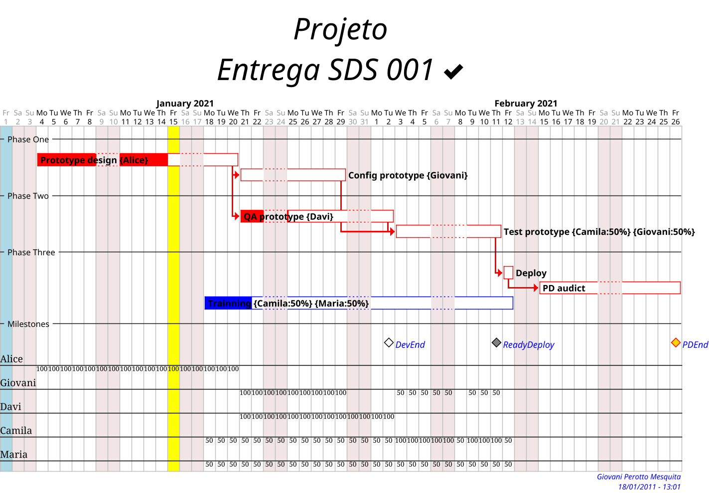

# required metadata

title: [Building Gant diagrams with PlantUML]
description: [How build Gant diagram with scripting PlantUML tool.]
author: [https://github.com/GiovaniPM]
manager: Giovani Perotto Mesquita
ms.date: 1/20/2021
ms.topic: article
ms.prod: 
ms.service: 
ms.technology: 

# Building Gant diagrams with PlantUML

## Gant theme customization

```CSS
<style>

  ganttDiagram {

  	task {
  		...
  	}

  	milestone {
  		...
  	}

  	note {
  		...
  	}

  }

  footer {
   ...
  }

  title {
    ...
  }

</style>

skinparam ...
```
- **style** - Looks like CSS format
    - **task**
        - **FontName**
  		- **FontColor**
  		- **FontSize**
  		- **FontStyle**
  		- **BackGroundColor**
  		- **LineColor**
  	- **milestone**
  		- **FontColor**
  		- **FontSize**
  		- **FontStyle**
  		- **BackGroundColor**
  		- **LineColor**
  	- **note**
      	- **FontColor**
  		- **FontSize**
  		- **LineColor**
        - **BackGroundColor**
    - **footer**
        - **HorizontalAlignment**
    - **title**
        - **FontColor**
        - **FontSize**
        - **FontStyle**
        - **HorizontalAlignment**
- **skinparam** - Parameters
    - **footerFontColor**
    - **footerFontSize**
    - **footerFontStyle**
    - **titleBackgroundColor**
    - **titleBorderColor**
    - **titleBorderRoundCorner**
    - **titleBorderThickness**

## Project initialization

- **title**
```plantuml
ex.:
    title Project\nDelivery SDS 001
```
- **footer**
```plantuml
ex.:
    footer Giovani Perotto Mesquita\n18/01/2011 - 13:01
```
- **scale**
```plantuml
ex.:
    scale 1.5
```
- **hide**
```plantuml
ex.:
    hide footbox
```
- **printscale**
```plantuml
ex.:
    printscale weekly
```
- **project**
```plantuml
ex.:
    project starts the 2021/01/01
```

## Project day vision

- **today**
```plantuml
ex.:
    today is 2021/01/20 and is colored in Yellow
or
    today is 14 days after start and is colored in Yellow
```

## Close days

- **closed**
```plantuml
ex.:
    saturday are closed
    sunday are closed
    2021/01/01 is closed
    2021/01/01 is colored in lightblue
```

## Separators

- **-- ... --**
```plantuml
ex.:
    -- Phase One --
```

## Tasks

- **task**
    - **dinamic**
    ```plantuml
    ex.:
        [PlantUML1] lasts 13 days
    ```
    - **fixed**
    ```plantuml
    ex.:
        [PlantUML1] starts 2021/01/18
        [PlantUML1] ends 2021/02/12
    ```
- **link**
```plantuml
ex.:
    [PlantUML1] links to [[http://plantuml.com]]
```
- **resources**
```plantuml
ex.:
    [PlantUML1] on {User1:50}{User2:50} lasts 6 days
```
- **pauses**
```plantuml
ex.:
    [PlantUML1] pauses on monday
or
    [PlantUML1] pauses on 2021/01/12
```
- **colors**
```plantuml
ex.:
    [PlantUML1] is colored in Red/Red
```
- **note**
```plantuml
ex.:
    note bottom
      memo1 ...
      memo2 ...
      explanations1 ...
      explanations2 ...
    end note
```

## Flow

- **link**
```plantuml
ex.:
    [PlantUML2] starts at [PlantUML1]'s end with red bold link
```

## Progress

- **completed**
```plantuml
ex.:
    [PlanUML1] is 70% completed
```

## Milestone

- **milestone**
```plantuml
ex.:
    [Milestone1] happens at [PlantUML1]'s end
```

## Example


## Code
``` dos
| @startgantt
| <style>
| 
|   ganttDiagram {
| 
|   	task {
|   		FontName Courrier
|   		FontColor black
|   		FontSize 12
|   		FontStyle bold
|   		BackGroundColor Blue
|   		LineColor blue
|   	}
| 
|   	milestone {
|   		FontColor blue
|   		FontSize 12
|   		FontStyle italic
|   		BackGroundColor gold
|   		LineColor red
|   	}
| 
|   	note {
|   		FontColor DarkGreen
|   		FontSize 10
|   		LineColor lightgreen
|         BackGroundColor orange\yellow
|   	}
| 
|   }
| 
|   footer {
|     HorizontalAlignment right
|   }
| 
|   title {
|     FontColor black
|     FontSize 40
|     FontStyle italic
|     HorizontalAlignment center
|   }
| 
| </style>
| 
| skinparam footerFontColor blue
| skinparam footerFontSize 10
| skinparam footerFontStyle italic
| 'skinparam titleBackgroundColor Aqua-CadetBlue
| 'skinparam titleBorderColor blue
| 'skinparam titleBorderRoundCorner 15
| 'skinparam titleBorderThickness 2
| 
| ' Initialization
| title Projeto\nEntrega SDS 001 <&check>
| footer Giovani Perotto Mesquita\n18/01/2011 - 13:01
| scale 1.5
| hide footbox
| 'printscale weekly
| project starts the 2021/01/01
| 
| ' Day watching
| 'today is 2021/01/20 and is colored in Yellow
| today is 14 days after start and is colored in Yellow
| 
| ' Close Days
| saturday are closed
| sunday are closed
| 2021/01/01 is closed
| 2021/01/01 is colored in lightblue
| 
| ' Tasks and separators
| -- Phase One --
| [Prototype design] on {Alice} lasts 13 days
|   [Prototype design] links to [[http://plantuml.com]]
| 'note bottom
| '  memo1 ...
| '  memo2 ...
| '  explanations1 ...
| '  explanations2 ...
| '  
| 'end note
| [Config prototype] on {Giovani} lasts 7 days
| 'note bottom
| '  WiFi <&wifi>
| '  |= |= table |= header |
| '  | a | table | row |
| '  |<#FF8080> red |<#80FF80> green |<#8080FF> blue |
| '  <#yellow>| b | table | row |
| 'end note
| -- Phase Two --
| [QA prototype] on {Davi} lasts 9 days
| [Test prototype] on {Camila:50}{Giovani:50} lasts 6 days
| -- Phase Three --
| [Deploy] lasts 1 day
| 'note bottom
| '  Example of Tree
| '  |_ First line
| '  |_ **Bom(Model)**
| '    |_ prop1
| '    |_ prop2
| '    |_ prop3
| '  |_ Last line
| 'end note
| [PD audict] lasts 10 days
| [Trainning] on {Camila:50}{Maria:50} starts 2021/01/18
|   [Trainning] ends 2021/02/12
| -- Milestones --
| 
| ' Tasks flow
| [Config prototype] starts at [Prototype design]'s end with red bold link
| [QA prototype] starts at [Prototype design]'s end with red bold link
| [Test prototype] starts at [Config prototype]'s end with red bold link
|   [Test prototype] starts at [QA prototype]'s end with red bold link
|   [Test prototype] pauses on monday
| [Deploy] starts at [Test prototype]'s end with red bold link
| [PD audict] starts at [Deploy]'s end with red bold link
| 
| ' Tasks progress
| [Prototype design] is 70% completed
| [Config prototype] is 0% completed
| [QA prototype] is 23% completed
| [Test prototype] is 0% completed
| [Deploy] is 0% completed
| [PD audict] is 0% completed
| [Trainning] is 20% completed
| 
| ' Milestones
| [DevEnd] happens at [Prototype design]'s end
|   [DevEnd] happens at [QA prototype]'s end
| [ReadyDeploy] happens at [Test prototype]'s end
|   [ReadyDeploy] displays on same row as [DevEnd]
| [PDEnd] happens at [PD audict]'s end
| [PDEnd] displays on same row as [ReadyDeploy]
| 
| ' Colors
| [Prototype design] is colored in Red/Red
| [Config prototype] is colored in Red/Red
| [QA prototype] is colored in Red/Red
| [Test prototype] is colored in Red/Red
| [Deploy] is colored in Red/Red
| [PD audict] is colored in Red/Red
| [DevEnd] is colored in White/Black
| [ReadyDeploy] is colored in Gray/Black
| @endgantt
```