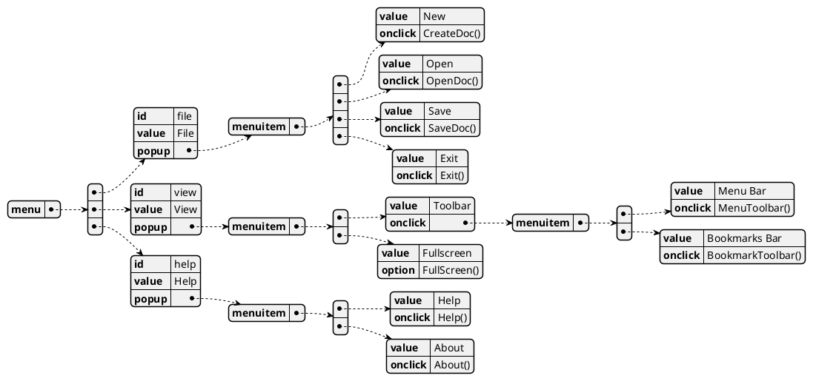

# Teste

```plantuml
@startjson
{
  "menu": [
    {
      "id": "file",
      "value": "File",
      "popup": {
        "menuitem": [
          {
            "value": "New",
            "onclick": "CreateDoc()"
          },
          {
            "value": "Open",
            "onclick": "OpenDoc()"
          },
          {
            "value": "Save",
            "onclick": "SaveDoc()"
          },
          {
            "value": "Exit",
            "onclick": "Exit()"
          }
        ]
      }
    },
    {
      "id": "view",
      "value": "View",
      "popup": {
        "menuitem": [
          {
            "value": "Toolbar",
            "onclick": {
              "menuitem": [
                {
                  "value": "Menu Bar",
                  "onclick": "MenuToolbar()"
                },
                {
                  "value": "Bookmarks Bar",
                  "onclick": "BookmarkToolbar()"
                }
              ]
            }
          },
          {
             "value": "Fullscreen",
             "option": "FullScreen()"
          }
        ]
      }
    },
    {
      "id": "help",
      "value": "Help",
      "popup": {
        "menuitem": [
          {
            "value": "Help",
            "onclick": "Help()"
          },
          {
            "value": "About",
            "onclick": "About()"
          }
        ]
      }
    }
  ]
}
@endjson
```