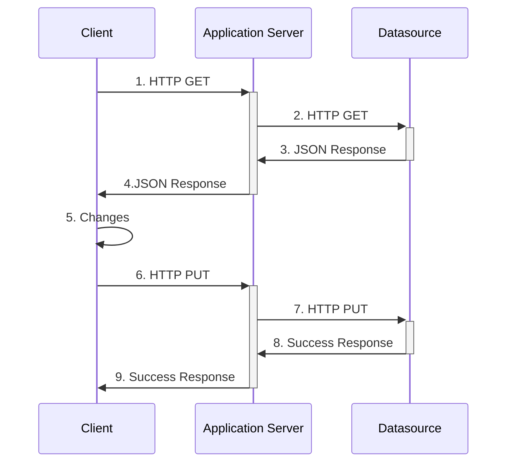

# DMNTests

## How it works

## Examples

### [string_integer_decision](https://github.com/GiovaniPM/DMNTests/blob/main/string_integer_decision.md)

## Know issues
- [ ] Unknown charges can corrupt the .dmn file, in the meantime back up the original file.

[](https://mermaid-js.github.io/mermaid-live-editor/#/edit/eyJjb2RlIjoic2VxdWVuY2VEaWFncmFtXG4gICAgQ2xpZW50LT4-K0FwcGxpY2F0aW9uIFNlcnZlcjogMS4gSFRUUCBHRVRcbiAgICBBcHBsaWNhdGlvbiBTZXJ2ZXItPj4rRGF0YXNvdXJjZTogMi4gSFRUUCBHRVRcbiAgICBEYXRhc291cmNlLT4-LUFwcGxpY2F0aW9uIFNlcnZlcjogMy4gSlNPTiBSZXNwb25zZVxuICAgIEFwcGxpY2F0aW9uIFNlcnZlci0-Pi1DbGllbnQ6IDQuSlNPTiBSZXNwb25zZVxuICAgIENsaWVudC0-PkNsaWVudDogNS4gQ2hhbmdlc1xuICAgIENsaWVudC0-PitBcHBsaWNhdGlvbiBTZXJ2ZXI6IDYuIEhUVFAgUFVUXG4gICAgQXBwbGljYXRpb24gU2VydmVyLT4-K0RhdGFzb3VyY2U6IDcuIEhUVFAgUFVUXG4gICAgRGF0YXNvdXJjZS0-Pi1BcHBsaWNhdGlvbiBTZXJ2ZXI6IDguIFN1Y2Nlc3MgUmVzcG9uc2VcbiAgICBBcHBsaWNhdGlvbiBTZXJ2ZXItPj4tQ2xpZW50OiA5LiBTdWNjZXNzIFJlc3BvbnNlIiwibWVybWFpZCI6eyJ0aGVtZSI6ImRlZmF1bHQifSwidXBkYXRlRWRpdG9yIjpmYWxzZX0)