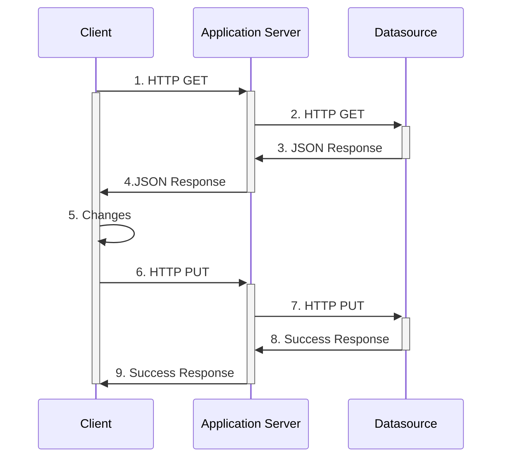

[](https://mermaid-js.github.io/mermaid-live-editor/#/edit/eyJjb2RlIjoic2VxdWVuY2VEaWFncmFtXG4gICAgQ2xpZW50LT4-K0FwcGxpY2F0aW9uIFNlcnZlcjogMS4gSFRUUCBHRVRcbiAgICBhY3RpdmF0ZSBDbGllbnRcbiAgICBBcHBsaWNhdGlvbiBTZXJ2ZXItPj4rRGF0YXNvdXJjZTogMi4gSFRUUCBHRVRcbiAgICBEYXRhc291cmNlLT4-LUFwcGxpY2F0aW9uIFNlcnZlcjogMy4gSlNPTiBSZXNwb25zZVxuICAgIEFwcGxpY2F0aW9uIFNlcnZlci0-Pi1DbGllbnQ6IDQuSlNPTiBSZXNwb25zZVxuICAgIENsaWVudC0-PkNsaWVudDogNS4gQ2hhbmdlc1xuICAgIENsaWVudC0-PitBcHBsaWNhdGlvbiBTZXJ2ZXI6IDYuIEhUVFAgUFVUXG4gICAgQXBwbGljYXRpb24gU2VydmVyLT4-K0RhdGFzb3VyY2U6IDcuIEhUVFAgUFVUXG4gICAgRGF0YXNvdXJjZS0-Pi1BcHBsaWNhdGlvbiBTZXJ2ZXI6IDguIFN1Y2Nlc3MgUmVzcG9uc2VcbiAgICBBcHBsaWNhdGlvbiBTZXJ2ZXItPj4tQ2xpZW50OiA5LiBTdWNjZXNzIFJlc3BvbnNlXG4gICAgZGVhY3RpdmF0ZSBDbGllbnQiLCJtZXJtYWlkIjp7InRoZW1lIjoiZGVmYXVsdCJ9LCJ1cGRhdGVFZGl0b3IiOmZhbHNlfQ)

```plantuml
!define ICONURL https://raw.githubusercontent.com/tupadr3/plantuml-icon-font-sprites/v2.1.0
skinparam defaultTextAlignment center
!include ICONURL/common.puml
!include ICONURL/font-awesome-5/gitlab.puml
!include ICONURL/font-awesome-5/java.puml
!include ICONURL/font-awesome-5/rocket.puml
!include ICONURL/font-awesome/newspaper_o.puml
FA_NEWSPAPER_O(news,good news!,node) #White {
FA5_GITLAB(gitlab,GitLab.com,node) #White
FA5_JAVA(java,PlantUML,node) #White
FA5_ROCKET(rocket,Integrated,node) #White
}
gitlab ..> java
java ..> rocket
```